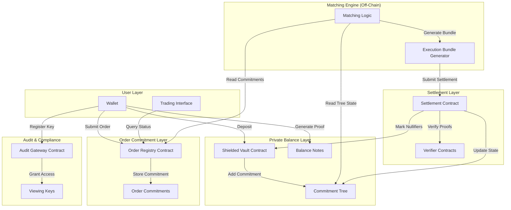

# Phantom Darkpool - Design Document

## Overview

Phantom Darkpool is a zero-knowledge private trading infrastructure that enables fully confidential decentralized trading while maintaining public verifiability. The system eliminates front-running, MEV exploitation, strategy leakage, and balance surveillance through cryptographic privacy guarantees.

The architecture consists of four primary layers:

1. **Private Balance Layer**: Manages shielded asset balances using UTXO-based encrypted notes
2. **Order Commitment Layer**: Processes private orders as cryptographic commitments
3. **Matching Engine**: Identifies compatible orders without decrypting values
4. **Settlement Layer**: Executes trades and updates private balances with zero-knowledge proofs

All sensitive data (balances, order details, trade amounts) remains encrypted while the system provides cryptographic proofs of correctness for deposits, withdrawals, order validity, and trade execution.

### Key Design Principles

- **Privacy by Default**: All trading activity is confidential unless explicitly disclosed
- **Public Verifiability**: Anyone can verify system correctness without seeing private data
- **Non-Custodial**: Users maintain full control of their assets
- **Trustless Execution**: No trusted third parties required for operation
- **Selective Disclosure**: Users can generate viewing keys for compliance/auditing
- **Deterministic Matching**: Fair order matching with price-time priority

## UI/UX Design System

### Color Palette

The Phantom Darkpool interface uses a dark, cyberpunk-inspired color scheme that emphasizes privacy and sophistication while maintaining excellent readability and accessibility.

**Primary Colors**:
- `#0A0A0B` — **Deep Black** (main background)
  - Usage: Primary background for all pages and containers
  - Creates depth and focus on content
  
- `#14161A` — **Graphite Surface**
  - Usage: Cards, panels, elevated surfaces
  - Provides subtle contrast against main background

**Accent Colors**:
- `#8B5CF6` — **Electric Violet** (primary accent)
  - Usage: Primary CTAs, active states, important highlights
  - Represents privacy, security, and premium features
  
- `#22D3EE` — **Neon Cyan** (secondary accent)
  - Usage: Secondary actions, links, data visualization
  - Provides energy and modern tech aesthetic

**Text Colors**:
- `#E5E7EB` — **Soft White**
  - Usage: Primary text, headings, important information
  - High contrast for readability
  
- `#6B7280` — **Muted Gray**
  - Usage: Secondary text, labels, metadata
  - Reduces visual noise while maintaining legibility

### Color Usage Guidelines

**Backgrounds**:
```css
.page-background { background: #0A0A0B; }
.card-surface { background: #14161A; }
.elevated-panel { background: #14161A; box-shadow: 0 4px 6px rgba(0,0,0,0.3); }
```

**Interactive Elements**:
```css
.btn-primary { 
  background: #8B5CF6; 
  color: #E5E7EB;
}
.btn-primary:hover { 
  background: #7C3AED; 
}

.btn-secondary { 
  background: transparent; 
  border: 1px solid #22D3EE;
  color: #22D3EE;
}
.btn-secondary:hover { 
  background: rgba(34, 211, 238, 0.1);
}
```

**Status Indicators**:
```css
.status-active { color: #22D3EE; }
.status-pending { color: #8B5CF6; }
.status-success { color: #10B981; }
.status-error { color: #EF4444; }
.status-warning { color: #F59E0B; }
```

**Typography**:
```css
.text-primary { color: #E5E7EB; }
.text-secondary { color: #6B7280; }
.text-accent { color: #8B5CF6; }
.text-link { color: #22D3EE; }
```

**Data Visualization**:
- Use Electric Violet (#8B5CF6) for primary data series
- Use Neon Cyan (#22D3EE) for secondary data series
- Use gradients between these colors for depth charts
- Maintain 4.5:1 contrast ratio minimum for accessibility

### Design Tokens

```typescript
export const colors = {
  background: {
    primary: '#0A0A0B',
    surface: '#14161A',
    elevated: '#1F2937',
  },
  accent: {
    primary: '#8B5CF6',
    secondary: '#22D3EE',
  },
  text: {
    primary: '#E5E7EB',
    secondary: '#6B7280',
    accent: '#8B5CF6',
    link: '#22D3EE',
  },
  status: {
    success: '#10B981',
    error: '#EF4444',
    warning: '#F59E0B',
    info: '#22D3EE',
  },
  border: {
    default: 'rgba(107, 114, 128, 0.2)',
    focus: '#8B5CF6',
    hover: '#22D3EE',
  }
};
```

### Accessibility Considerations

- All text maintains WCAG AA contrast ratios (4.5:1 minimum)
- Primary text (#E5E7EB) on Deep Black (#0A0A0B): 14.8:1 ratio
- Electric Violet (#8B5CF6) on Deep Black (#0A0A0B): 7.2:1 ratio
- Neon Cyan (#22D3EE) on Deep Black (#0A0A0B): 9.8:1 ratio
- Focus states use 2px solid borders with accent colors
- Interactive elements have minimum 44x44px touch targets

## Architecture

### System Architecture Diagram




### Layer Interactions

**Deposit Flow**:
1. User deposits assets to Shielded Vault
2. Vault creates encrypted Balance Note
3. Balance Note commitment added to Commitment Tree
4. User receives note details (encrypted locally)

**Order Submission Flow**:
1. User creates order commitment (asset pair, amount, price, expiration)
2. User generates Order Validity Proof
3. Order commitment + proof submitted to Order Registry
4. Registry stores commitment hash on-chain

**Matching Flow**:
1. Matching Engine reads active order commitments
2. Engine identifies compatible orders using public metadata
3. Engine generates Execution Bundle with proofs
4. Bundle submitted to Settlement Contract

**Settlement Flow**:
1. Settlement Contract verifies all proofs (Balance, Order Validity, Trade Conservation, Matching Correctness)
2. Contract checks nullifiers not reused
3. Contract creates new Balance Notes for both parties
4. Contract updates Commitment Tree and marks nullifiers as spent

## Components and Interfaces

### Smart Contracts

#### 1. Shielded Vault Contract

**Purpose**: Manages deposits, withdrawals, and Balance Note creation

**State Variables**:
```solidity
mapping(bytes32 => bool) public nullifiers;  // Spent nullifiers
mapping(address => bool) public supportedAssets;  // Whitelisted assets
uint256 public commitmentTreeRoot;  // Current Merkle root
```

**Key Functions**:

```solidity
function deposit(
    address asset,
    uint256 amount,
    bytes32 noteCommitment
) external returns (uint256 noteIndex);

function withdraw(
    bytes32 nullifier,
    address recipient,
    uint256 amount,
    bytes calldata balanceProof,
    bytes32[] calldata merkleProof
) external;

function isNullifierSpent(bytes32 nullifier) external view returns (bool);
```

**Events**:
```solidity
event Deposit(bytes32 indexed commitment, uint256 noteIndex, uint256 timestamp);
event Withdrawal(bytes32 indexed nullifier, address recipient, uint256 timestamp);
```

#### 2. Order Registry Contract

**Purpose**: Stores order commitments and manages order lifecycle

**State Variables**:
```solidity
struct OrderMetadata {
    bytes32 commitmentHash;
    uint256 timestamp;
    uint256 expiration;
    bool active;
    bool cancelled;
}

mapping(bytes32 => OrderMetadata) public orders;
bytes32[] public activeOrderHashes;
```


**Key Functions**:
```solidity
function submitOrder(
    bytes32 orderCommitment,
    uint256 expiration,
    bytes calldata orderValidityProof
) external returns (bytes32 orderId);

function cancelOrder(
    bytes32 orderId,
    bytes calldata ownershipProof
) external;

function isOrderActive(bytes32 orderId) external view returns (bool);

function getActiveOrders() external view returns (bytes32[] memory);
```

**Events**:
```solidity
event OrderSubmitted(bytes32 indexed orderId, bytes32 commitment, uint256 expiration);
event OrderCancelled(bytes32 indexed orderId);
event OrderExpired(bytes32 indexed orderId);
```

#### 3. Settlement Contract

**Purpose**: Verifies execution proofs and settles trades

**State Variables**:
```solidity
address public balanceProofVerifier;
address public orderValidityVerifier;
address public tradeConservationVerifier;
address public matchingCorrectnessVerifier;

mapping(bytes32 => bool) public settledExecutions;
```

**Key Functions**:
```solidity
function settleExecution(
    bytes32 executionId,
    bytes32[] calldata orderIds,
    bytes32[] calldata inputNullifiers,
    bytes32[] calldata outputCommitments,
    bytes calldata balanceProofs,
    bytes calldata orderValidityProofs,
    bytes calldata tradeConservationProof,
    bytes calldata matchingCorrectnessProof
) external returns (bool);

function verifyProof(
    address verifier,
    bytes calldata proof,
    bytes32[] calldata publicInputs
) internal view returns (bool);
```

**Events**:
```solidity
event ExecutionSettled(
    bytes32 indexed executionId,
    bytes32[] orderIds,
    uint256 timestamp
);
event SettlementFailed(bytes32 indexed executionId, string reason);
```

#### 4. Audit Gateway Contract

**Purpose**: Manages viewing keys for selective disclosure

**State Variables**:
```solidity
struct ViewingKey {
    address owner;
    bytes32 dataScope;  // Hash of what data this key can access
    uint256 expiration;
    bool revoked;
}

mapping(bytes32 => ViewingKey) public viewingKeys;
mapping(address => bytes32[]) public userKeys;
```


**Key Functions**:
```solidity
function registerViewingKey(
    bytes32 keyId,
    bytes32 dataScope,
    uint256 expiration
) external;

function revokeViewingKey(bytes32 keyId) external;

function isKeyValid(bytes32 keyId) external view returns (bool);
```

### Off-Chain Components

#### Matching Engine

**Purpose**: Identifies compatible orders and generates execution bundles

**Architecture**:
- Stateless service that reads from Order Registry
- Runs deterministic matching algorithm
- Generates zero-knowledge proofs for matched orders
- Submits execution bundles to Settlement Contract

**Matching Algorithm**:
```
1. Fetch all active order commitments from Order Registry
2. For each order pair (A, B):
   a. Check if asset pairs are compatible (A sells what B buys)
   b. Check if both orders are unexpired
   c. Apply price-time priority rules
3. Generate Execution Bundle with:
   - Matched order IDs
   - Matching Correctness Proof
   - Trade Conservation Proof
4. Submit bundle to Settlement Contract
```

**Key Operations**:
- `fetchActiveOrders()`: Retrieve order commitments from registry
- `findMatches(orders)`: Apply matching logic
- `generateExecutionBundle(matchedOrders)`: Create settlement data
- `submitSettlement(bundle)`: Send to Settlement Contract


#### Wallet SDK

**Purpose**: Client-side proof generation and encrypted state management

**Key Capabilities**:
- Generate zero-knowledge proofs locally
- Manage encrypted Balance Notes
- Create order commitments
- Handle viewing key generation
- Store encrypted state in browser IndexedDB

**API Interface**:
```typescript
interface PhantomWallet {
  // Balance operations
  createPrivateBalance(asset: string, amount: bigint): Promise<BalanceNote>;
  getBalance(asset: string): Promise<bigint>;
  
  // Order operations
  generateOrderCommitment(order: OrderParams): Promise<OrderCommitment>;
  submitOrder(commitment: OrderCommitment): Promise<string>;
  
  // Proof generation
  generateBalanceProof(note: BalanceNote): Promise<Proof>;
  generateOrderValidityProof(order: OrderParams): Promise<Proof>;
  
  // Viewing keys
  createViewingKey(scope: DataScope): Promise<ViewingKey>;
  revokeViewingKey(keyId: string): Promise<void>;
  
  // Withdrawal
  withdraw(asset: string, amount: bigint, recipient: string): Promise<string>;
}
```

## Data Models

### Balance Note

**Structure**:
```typescript
interface BalanceNote {
  asset: string;           // Asset address
  amount: bigint;          // Balance amount
  salt: bigint;            // Random blinding factor
  owner: string;           // Owner's public key
  nullifier: bytes32;      // Unique spend identifier
  commitment: bytes32;     // Pedersen commitment
}
```


**Commitment Calculation**:
```
commitment = PedersenCommit(asset || amount || salt || owner)
nullifier = Poseidon(commitment || nullifierSecret)
```

**Properties**:
- Binding: Cannot change values without changing commitment
- Hiding: Commitment reveals nothing about underlying values
- Unlinkable: Cannot link multiple notes to same owner without viewing key

### Order Commitment

**Structure**:
```typescript
interface OrderCommitment {
  assetPair: {
    base: string;          // Base asset address
    quote: string;         // Quote asset address
  };
  amount: bigint;          // Order size
  price: bigint;           // Limit price (scaled by 1e18)
  orderType: OrderType;    // BUY or SELL
  expiration: number;      // Unix timestamp
  nonce: bigint;           // Unique order identifier
  owner: string;           // Owner's public key
  commitmentHash: bytes32; // Hash of encrypted order
}
```

**Commitment Calculation**:
```
orderData = encode(assetPair, amount, price, orderType, expiration, nonce, owner)
commitmentHash = Poseidon(orderData)
```

**Public Metadata** (stored on-chain):
```typescript
interface OrderMetadata {
  commitmentHash: bytes32;
  timestamp: number;
  expiration: number;
  active: boolean;
}
```


### Execution Bundle

**Structure**:
```typescript
interface ExecutionBundle {
  executionId: bytes32;
  orderIds: bytes32[];
  
  // Input balance notes (being spent)
  inputNullifiers: bytes32[];
  inputBalanceProofs: Proof[];
  
  // Output balance notes (newly created)
  outputCommitments: bytes32[];
  
  // Order proofs
  orderValidityProofs: Proof[];
  
  // Trade proofs
  tradeConservationProof: Proof;
  matchingCorrectnessProof: Proof;
  
  // Merkle proofs
  merkleProofs: MerkleProof[];
}
```

**Validation Requirements**:
- All input nullifiers must not be spent
- All balance proofs must verify
- All order validity proofs must verify
- Trade conservation proof must verify (inputs = outputs)
- Matching correctness proof must verify (price rules satisfied)
- All Merkle proofs must verify against current tree root

### Merkle Tree Structure

**Commitment Tree**:
```typescript
interface CommitmentTree {
  depth: number;           // Tree depth (e.g., 20 for 1M leaves)
  root: bytes32;           // Current Merkle root
  leaves: bytes32[];       // Balance note commitments
  hashFunction: Function;  // Poseidon hash
}
```

**Tree Operations**:
- `insert(commitment)`: Add new balance note commitment
- `getRoot()`: Return current root
- `getMerkleProof(leafIndex)`: Generate membership proof
- `verifyProof(leaf, proof, root)`: Verify membership


**Implementation**: Use incremental Merkle tree with Poseidon hash
- Library: `@zk-kit/incremental-merkle-tree`
- Depth: 20 (supports 1,048,576 notes)
- Hash: Poseidon (ZK-friendly)

### Viewing Key

**Structure**:
```typescript
interface ViewingKey {
  keyId: bytes32;
  owner: string;
  dataScope: DataScope;
  expiration: number;
  revoked: boolean;
  decryptionKey: bytes32;  // Stored off-chain
}

enum DataScope {
  BALANCE_NOTE,
  ORDER_COMMITMENT,
  TRADE_HISTORY,
  ALL
}
```

**Usage**:
1. User generates viewing key for specific data scope
2. User registers key hash on Audit Gateway
3. User shares decryption key with auditor off-chain
4. Auditor uses key to decrypt authorized data

## Zero-Knowledge Circuit Designs

### Circuit 1: Balance Proof

**Purpose**: Prove ownership of sufficient funds without revealing amount

**Public Inputs**:
- `merkleRoot`: Current commitment tree root
- `nullifier`: Nullifier being spent
- `minAmount`: Minimum required balance (for order validation)

**Private Inputs**:
- `asset`: Asset address
- `amount`: Actual balance
- `salt`: Blinding factor
- `owner`: Owner's public key
- `nullifierSecret`: Secret for nullifier generation
- `merkleProof`: Proof of commitment membership


**Circuit Constraints**:
```circom
template BalanceProof() {
    // Public inputs
    signal input merkleRoot;
    signal input nullifier;
    signal input minAmount;
    
    // Private inputs
    signal input asset;
    signal input amount;
    signal input salt;
    signal input owner;
    signal input nullifierSecret;
    signal input merkleProof[TREE_DEPTH];
    
    // Constraint 1: Verify commitment
    component commitment = PedersenCommit();
    commitment.inputs <== [asset, amount, salt, owner];
    signal computedCommitment <== commitment.out;
    
    // Constraint 2: Verify nullifier
    component nullifierHash = Poseidon(2);
    nullifierHash.inputs[0] <== computedCommitment;
    nullifierHash.inputs[1] <== nullifierSecret;
    nullifier === nullifierHash.out;
    
    // Constraint 3: Verify Merkle proof
    component merkleVerifier = MerkleTreeVerifier(TREE_DEPTH);
    merkleVerifier.leaf <== computedCommitment;
    merkleVerifier.proof <== merkleProof;
    merkleVerifier.root <== merkleRoot;
    merkleVerifier.valid === 1;
    
    // Constraint 4: Verify sufficient balance
    component greaterThan = GreaterEqThan(252);
    greaterThan.in[0] <== amount;
    greaterThan.in[1] <== minAmount;
    greaterThan.out === 1;
}
```

**Verification**: On-chain verifier contract checks proof validity


### Circuit 2: Order Validity Proof

**Purpose**: Prove order parameters are within allowed ranges without revealing values

**Public Inputs**:
- `orderCommitmentHash`: Hash of order commitment
- `timestamp`: Current timestamp

**Private Inputs**:
- `assetPair`: Base and quote asset addresses
- `amount`: Order size
- `price`: Limit price
- `orderType`: BUY or SELL
- `expiration`: Expiration timestamp
- `nonce`: Unique order identifier
- `owner`: Owner's public key

**Circuit Constraints**:
```circom
template OrderValidityProof() {
    // Public inputs
    signal input orderCommitmentHash;
    signal input timestamp;
    
    // Private inputs
    signal input baseAsset;
    signal input quoteAsset;
    signal input amount;
    signal input price;
    signal input orderType;
    signal input expiration;
    signal input nonce;
    signal input owner;
    
    // Constraint 1: Verify commitment hash
    component hasher = Poseidon(8);
    hasher.inputs[0] <== baseAsset;
    hasher.inputs[1] <== quoteAsset;
    hasher.inputs[2] <== amount;
    hasher.inputs[3] <== price;
    hasher.inputs[4] <== orderType;
    hasher.inputs[5] <== expiration;
    hasher.inputs[6] <== nonce;
    hasher.inputs[7] <== owner;
    orderCommitmentHash === hasher.out;
    
    // Constraint 2: Verify amount is positive and within bounds
    component amountCheck = RangeCheck(252);
    amountCheck.in <== amount;
    amountCheck.min <== 1;
    amountCheck.max <== MAX_ORDER_SIZE;
    amountCheck.valid === 1;
    
    // Constraint 3: Verify price is positive and within bounds
    component priceCheck = RangeCheck(252);
    priceCheck.in <== price;
    priceCheck.min <== MIN_PRICE;
    priceCheck.max <== MAX_PRICE;
    priceCheck.valid === 1;
    
    // Constraint 4: Verify order type is valid (0 or 1)
    orderType * (orderType - 1) === 0;
    
    // Constraint 5: Verify not expired
    component expirationCheck = GreaterThan(64);
    expirationCheck.in[0] <== expiration;
    expirationCheck.in[1] <== timestamp;
    expirationCheck.out === 1;
    
    // Constraint 6: Verify assets are different
    component assetCheck = IsEqual();
    assetCheck.in[0] <== baseAsset;
    assetCheck.in[1] <== quoteAsset;
    assetCheck.out === 0;
}
```

### Circuit 3: Trade Conservation Proof

**Purpose**: Prove that trade inputs equal outputs (no value created/destroyed)

**Public Inputs**:
- `executionId`: Unique execution identifier
- `inputNullifiers`: Nullifiers of spent balance notes
- `outputCommitments`: Commitments of new balance notes


**Private Inputs**:
- `inputAssets[]`: Asset types of input notes
- `inputAmounts[]`: Amounts of input notes
- `inputSalts[]`: Salts of input notes
- `inputOwners[]`: Owners of input notes
- `outputAssets[]`: Asset types of output notes
- `outputAmounts[]`: Amounts of output notes
- `outputSalts[]`: Salts of output notes
- `outputOwners[]`: Owners of output notes

**Circuit Constraints**:
```circom
template TradeConservationProof(numInputs, numOutputs) {
    // Public inputs
    signal input executionId;
    signal input inputNullifiers[numInputs];
    signal input outputCommitments[numOutputs];
    
    // Private inputs
    signal input inputAssets[numInputs];
    signal input inputAmounts[numInputs];
    signal input inputSalts[numInputs];
    signal input inputOwners[numInputs];
    signal input inputNullifierSecrets[numInputs];
    
    signal input outputAssets[numOutputs];
    signal input outputAmounts[numOutputs];
    signal input outputSalts[numOutputs];
    signal input outputOwners[numOutputs];
    
    // Constraint 1: Verify input nullifiers
    component inputNullifierHashers[numInputs];
    component inputCommitments[numInputs];
    for (var i = 0; i < numInputs; i++) {
        inputCommitments[i] = PedersenCommit();
        inputCommitments[i].inputs <== [inputAssets[i], inputAmounts[i], 
                                        inputSalts[i], inputOwners[i]];
        
        inputNullifierHashers[i] = Poseidon(2);
        inputNullifierHashers[i].inputs[0] <== inputCommitments[i].out;
        inputNullifierHashers[i].inputs[1] <== inputNullifierSecrets[i];
        inputNullifiers[i] === inputNullifierHashers[i].out;
    }
    
    // Constraint 2: Verify output commitments
    component outputCommitmentHashers[numOutputs];
    for (var i = 0; i < numOutputs; i++) {
        outputCommitmentHashers[i] = PedersenCommit();
        outputCommitmentHashers[i].inputs <== [outputAssets[i], outputAmounts[i],
                                               outputSalts[i], outputOwners[i]];
        outputCommitments[i] === outputCommitmentHashers[i].out;
    }
    
    // Constraint 3: Verify conservation per asset
    // Sum inputs by asset = Sum outputs by asset
    signal inputSumsByAsset[MAX_ASSETS];
    signal outputSumsByAsset[MAX_ASSETS];
    
    // Accumulate input amounts per asset
    component inputAccumulators[numInputs];
    for (var i = 0; i < numInputs; i++) {
        // Add inputAmounts[i] to inputSumsByAsset[inputAssets[i]]
        // (Implementation depends on asset indexing strategy)
    }
    
    // Accumulate output amounts per asset
    component outputAccumulators[numOutputs];
    for (var i = 0; i < numOutputs; i++) {
        // Add outputAmounts[i] to outputSumsByAsset[outputAssets[i]]
    }
    
    // Verify equality for each asset
    for (var i = 0; i < MAX_ASSETS; i++) {
        inputSumsByAsset[i] === outputSumsByAsset[i];
    }
}
```

### Circuit 4: Matching Correctness Proof

**Purpose**: Prove that matched orders satisfy price compatibility rules

**Public Inputs**:
- `orderCommitmentHashes[]`: Hashes of matched orders
- `executionId`: Unique execution identifier


**Private Inputs**:
- `orderDetails[]`: Full order details (asset pair, amount, price, type)
- `matchingPairs[]`: Pairs of order indices that match

**Circuit Constraints**:
```circom
template MatchingCorrectnessProof(numOrders) {
    // Public inputs
    signal input orderCommitmentHashes[numOrders];
    signal input executionId;
    
    // Private inputs
    signal input baseAssets[numOrders];
    signal input quoteAssets[numOrders];
    signal input amounts[numOrders];
    signal input prices[numOrders];
    signal input orderTypes[numOrders];
    signal input expirations[numOrders];
    signal input nonces[numOrders];
    signal input owners[numOrders];
    
    // Constraint 1: Verify order commitment hashes
    component hashers[numOrders];
    for (var i = 0; i < numOrders; i++) {
        hashers[i] = Poseidon(8);
        hashers[i].inputs[0] <== baseAssets[i];
        hashers[i].inputs[1] <== quoteAssets[i];
        hashers[i].inputs[2] <== amounts[i];
        hashers[i].inputs[3] <== prices[i];
        hashers[i].inputs[4] <== orderTypes[i];
        hashers[i].inputs[5] <== expirations[i];
        hashers[i].inputs[6] <== nonces[i];
        hashers[i].inputs[7] <== owners[i];
        orderCommitmentHashes[i] === hashers[i].out;
    }
    
    // Constraint 2: Verify price compatibility for matched pairs
    // For each pair (i, j) where i is BUY and j is SELL:
    // buyPrice[i] >= sellPrice[j]
    for (var i = 0; i < numOrders; i += 2) {
        var buyIdx = i;
        var sellIdx = i + 1;
        
        // Verify one is BUY (0) and other is SELL (1)
        orderTypes[buyIdx] === 0;
        orderTypes[sellIdx] === 1;
        
        // Verify asset pairs match (buy base = sell base, buy quote = sell quote)
        baseAssets[buyIdx] === baseAssets[sellIdx];
        quoteAssets[buyIdx] === quoteAssets[sellIdx];
        
        // Verify price compatibility: buyPrice >= sellPrice
        component priceCheck = GreaterEqThan(252);
        priceCheck.in[0] <== prices[buyIdx];
        priceCheck.in[1] <== prices[sellIdx];
        priceCheck.out === 1;
        
        // Verify amounts match
        amounts[buyIdx] === amounts[sellIdx];
    }
}
```

### Circuit Implementation Strategy

**Technology Choice**: Circom + SnarkJS with Groth16
- **Rationale**: Fastest verification, smallest proofs, production-ready
- **Alternative**: Noir for better developer experience (consider for v2)

**Proof System**: Groth16
- Verification time: <500ms on-chain
- Proof size: ~200 bytes (3 elliptic curve points)
- Trusted setup: Required (use Powers of Tau ceremony)

**Hash Functions**:
- **Poseidon**: For nullifiers, Merkle trees, commitment hashes
- **Pedersen**: For balance note commitments

**Libraries**:
- `circomlib`: Standard circuit library
- `snarkjs`: Proof generation and verification
- `@zk-kit/incremental-merkle-tree`: Merkle tree management

## Cryptographic Protocols

### Pedersen Commitments

**Purpose**: Create binding and hiding commitments for balance notes


**Implementation**:
```typescript
import { pedersenCommit } from 'bigint-pedersen';

function createBalanceCommitment(
  asset: bigint,
  amount: bigint,
  salt: bigint,
  owner: bigint
): bigint {
  const message = [asset, amount, salt, owner];
  return pedersenCommit(message);
}
```

**Properties**:
- **Binding**: Computationally infeasible to find two different messages with same commitment
- **Hiding**: Commitment reveals no information about message without opening
- **Homomorphic**: Supports addition of commitments

**Security**: Based on discrete logarithm problem on elliptic curves

### Poseidon Hash Function

**Purpose**: ZK-friendly hash for nullifiers and Merkle trees

**Implementation**:
```typescript
import { poseidon } from 'circomlibjs';

function generateNullifier(
  commitment: bigint,
  nullifierSecret: bigint
): bigint {
  return poseidon([commitment, nullifierSecret]);
}

function hashMerkleNode(left: bigint, right: bigint): bigint {
  return poseidon([left, right]);
}
```

**Advantages**:
- 8x fewer constraints than Pedersen hash in circuits
- Optimized for prime field arithmetic
- Sponge construction (variable input length)

**Parameters**:
- Field: BN254 scalar field
- Width: 2-16 (configurable)
- Rounds: Full rounds + partial rounds


### Nullifier System

**Purpose**: Prevent double-spending of balance notes

**Nullifier Generation**:
```
nullifier = Poseidon(commitment, nullifierSecret)
```

**Properties**:
- **Uniqueness**: Each balance note has unique nullifier
- **Unlinkability**: Cannot link nullifier to commitment without secret
- **Deterministic**: Same inputs always produce same nullifier

**Usage Pattern**:
1. User generates nullifier when spending balance note
2. User includes nullifier in transaction
3. Contract checks nullifier not in spent set
4. Contract adds nullifier to spent set
5. Future transactions with same nullifier are rejected

**Storage**: On-chain mapping in Shielded Vault contract
```solidity
mapping(bytes32 => bool) public nullifiers;
```

### Key Derivation

**Master Key Generation**:
```typescript
// User's master secret (from wallet seed)
const masterSecret = derivePath(seed, "m/44'/60'/0'/0/0");

// Derive nullifier secret
const nullifierSecret = keccak256(masterSecret || "nullifier");

// Derive viewing key
const viewingKey = keccak256(masterSecret || "viewing");
```

**Balance Note Keys**:
```typescript
// Each balance note has unique salt
const salt = randomBytes(32);

// Commitment includes owner's public key
const owner = publicKeyFromPrivate(masterSecret);
```

## API Specifications

### Wallet Integration API

**createPrivateBalance**
```typescript
async function createPrivateBalance(
  asset: string,
  amount: bigint
): Promise<BalanceNote> {
  const salt = generateRandomSalt();
  const owner = await getPublicKey();
  const commitment = createBalanceCommitment(asset, amount, salt, owner);
  const nullifierSecret = await getNullifierSecret();
  const nullifier = generateNullifier(commitment, nullifierSecret);
  
  return {
    asset,
    amount,
    salt,
    owner,
    nullifier,
    commitment
  };
}
```


**generateOrderCommitment**
```typescript
async function generateOrderCommitment(
  order: OrderParams
): Promise<OrderCommitment> {
  const nonce = generateRandomNonce();
  const owner = await getPublicKey();
  
  const orderData = {
    assetPair: order.assetPair,
    amount: order.amount,
    price: order.price,
    orderType: order.orderType,
    expiration: order.expiration,
    nonce,
    owner
  };
  
  const commitmentHash = poseidon([
    orderData.assetPair.base,
    orderData.assetPair.quote,
    orderData.amount,
    orderData.price,
    orderData.orderType,
    orderData.expiration,
    orderData.nonce,
    orderData.owner
  ]);
  
  return {
    ...orderData,
    commitmentHash
  };
}
```

**generateExecutionWitness**
```typescript
async function generateExecutionWitness(
  inputNotes: BalanceNote[],
  outputNotes: BalanceNote[]
): Promise<ExecutionWitness> {
  const merkleProofs = await Promise.all(
    inputNotes.map(note => getMerkleProof(note.commitment))
  );
  
  return {
    inputNotes,
    outputNotes,
    merkleProofs,
    nullifierSecrets: await getNullifierSecrets(inputNotes.length)
  };
}
```

**revealForAudit**
```typescript
async function revealForAudit(
  dataScope: DataScope,
  expiration: number
): Promise<ViewingKey> {
  const keyId = generateRandomKeyId();
  const decryptionKey = await deriveViewingKey(dataScope);
  
  // Register key on-chain
  await auditGateway.registerViewingKey(
    keyId,
    hashDataScope(dataScope),
    expiration
  );
  
  return {
    keyId,
    owner: await getAddress(),
    dataScope,
    expiration,
    revoked: false,
    decryptionKey
  };
}
```


### Trading Interface API

**POST /orders**
```typescript
interface SubmitOrderRequest {
  orderCommitment: bytes32;
  expiration: number;
  orderValidityProof: Proof;
}

interface SubmitOrderResponse {
  orderId: bytes32;
  status: 'pending' | 'active';
  timestamp: number;
}

// Endpoint
POST /api/v1/orders
Content-Type: application/json

{
  "orderCommitment": "0x1234...",
  "expiration": 1735689600,
  "orderValidityProof": {
    "pi_a": [...],
    "pi_b": [...],
    "pi_c": [...],
    "publicSignals": [...]
  }
}
```

**GET /order-status**
```typescript
interface OrderStatusResponse {
  orderId: bytes32;
  status: 'pending' | 'active' | 'matched' | 'settled' | 'expired' | 'cancelled';
  timestamp: number;
  expiration: number;
  executionId?: bytes32;  // If matched/settled
}

// Endpoint
GET /api/v1/orders/{orderId}/status
```

**POST /withdraw**
```typescript
interface WithdrawRequest {
  nullifier: bytes32;
  recipient: string;
  amount: bigint;
  balanceProof: Proof;
  merkleProof: bytes32[];
}

interface WithdrawResponse {
  transactionHash: string;
  status: 'pending' | 'confirmed';
}

// Endpoint
POST /api/v1/withdraw
Content-Type: application/json
```


**GET /balance-proof**
```typescript
interface BalanceProofRequest {
  asset: string;
  minAmount?: bigint;
}

interface BalanceProofResponse {
  proof: Proof;
  merkleRoot: bytes32;
  nullifier: bytes32;
}

// Endpoint
GET /api/v1/balance-proof?asset=0x...&minAmount=1000000000000000000
```

**GET /commitment-tree**
```typescript
interface CommitmentTreeResponse {
  root: bytes32;
  depth: number;
  leafCount: number;
}

// Endpoint
GET /api/v1/commitment-tree
```

## Matching Engine Algorithm

### Algorithm Design

**Objective**: Match compatible orders while maintaining privacy

**Input**: Active order commitments from Order Registry

**Output**: Execution bundles with matched order pairs

**Algorithm**:
```typescript
async function matchOrders(): Promise<ExecutionBundle[]> {
  // Step 1: Fetch active orders
  const orders = await orderRegistry.getActiveOrders();
  
  // Step 2: Group by asset pair (from public metadata if available)
  const ordersByPair = groupByAssetPair(orders);
  
  // Step 3: For each asset pair, match orders
  const executionBundles: ExecutionBundle[] = [];
  
  for (const [assetPair, pairOrders] of ordersByPair) {
    // Separate buy and sell orders (if type is public)
    const buyOrders = pairOrders.filter(o => o.type === 'BUY');
    const sellOrders = pairOrders.filter(o => o.type === 'SELL');
    
    // Sort by price-time priority
    buyOrders.sort((a, b) => {
      if (a.price !== b.price) return b.price - a.price; // Higher price first
      return a.timestamp - b.timestamp; // Earlier timestamp first
    });
    
    sellOrders.sort((a, b) => {
      if (a.price !== b.price) return a.price - b.price; // Lower price first
      return a.timestamp - b.timestamp; // Earlier timestamp first
    });
    
    // Step 4: Match orders
    let buyIdx = 0;
    let sellIdx = 0;
    
    while (buyIdx < buyOrders.length && sellIdx < sellOrders.length) {
      const buyOrder = buyOrders[buyIdx];
      const sellOrder = sellOrders[sellIdx];
      
      // Check if orders can match (buy price >= sell price)
      if (buyOrder.price >= sellOrder.price) {
        // Create execution bundle
        const bundle = await createExecutionBundle(buyOrder, sellOrder);
        executionBundles.push(bundle);
        
        buyIdx++;
        sellIdx++;
      } else {
        // No more matches possible
        break;
      }
    }
  }
  
  return executionBundles;
}
```

**Note**: In fully private mode, order types and prices are hidden. The matching engine would need to:
1. Attempt matches based on encrypted metadata
2. Generate proofs that demonstrate compatibility
3. Submit bundles that may fail if orders don't actually match

**Alternative**: Use secure multi-party computation (MPC) for matching logic

### Execution Bundle Creation

```typescript
async function createExecutionBundle(
  buyOrder: Order,
  sellOrder: Order
): Promise<ExecutionBundle> {
  const executionId = generateExecutionId();
  
  // Generate proofs
  const orderValidityProofs = await Promise.all([
    generateOrderValidityProof(buyOrder),
    generateOrderValidityProof(sellOrder)
  ]);
  
  const matchingCorrectnessProof = await generateMatchingCorrectnessProof(
    [buyOrder, sellOrder]
  );
  
  return {
    executionId,
    orderIds: [buyOrder.id, sellOrder.id],
    orderValidityProofs,
    matchingCorrectnessProof,
    // Balance proofs and trade conservation proof added by users
  };
}
```


### Matching Modes

**Mode 1: Semi-Private Matching**
- Order type (BUY/SELL) is public
- Asset pair is public
- Price ranges are public (e.g., "between $1-$2")
- Exact amounts and prices are private
- Enables efficient matching with partial privacy

**Mode 2: Fully Private Matching**
- All order details are private
- Matching engine attempts matches blindly
- Users must provide proofs that orders are compatible
- Less efficient but maximum privacy

**Recommendation**: Start with Mode 1 for MVP, add Mode 2 in later phase

## Security Considerations

### Threat Model

**Adversary Capabilities**:
- Can observe all on-chain transactions
- Can run matching engine nodes
- Can submit malicious orders
- Can attempt to link users across transactions
- Cannot break cryptographic primitives (discrete log, hash functions)

**Security Goals**:
1. **Balance Privacy**: Adversary cannot determine user balances
2. **Order Privacy**: Adversary cannot determine order details
3. **Trade Privacy**: Adversary cannot determine trade amounts
4. **Identity Privacy**: Adversary cannot link multiple orders to same user
5. **Double-Spend Prevention**: Adversary cannot spend same balance note twice
6. **Soundness**: Adversary cannot create invalid proofs
7. **Completeness**: Honest users can always generate valid proofs

### Attack Vectors and Mitigations

**1. Double-Spend Attack**
- **Attack**: Reuse same balance note in multiple transactions
- **Mitigation**: Nullifier tracking in Shielded Vault contract
- **Implementation**: Reject any transaction with previously seen nullifier

**2. Front-Running Attack**
- **Attack**: Observe pending order and submit competing order first
- **Mitigation**: Orders are encrypted commitments; no actionable information leaked
- **Additional**: Use private mempool or commit-reveal scheme


**3. Replay Attack**
- **Attack**: Resubmit valid transaction from past
- **Mitigation**: Nullifiers are unique per balance note; nonces are unique per order
- **Implementation**: Track all used nullifiers and nonces

**4. Proof Malleability**
- **Attack**: Modify valid proof to create different valid proof
- **Mitigation**: Use Groth16 which has proof uniqueness property
- **Verification**: All proofs verified on-chain before acceptance

**5. Circuit Constraint Bugs**
- **Attack**: Exploit under-constrained circuits to create invalid proofs
- **Mitigation**: Formal verification of circuits; comprehensive testing
- **Process**: Audit all circuits before deployment; use proven circuit libraries

**6. Merkle Tree Manipulation**
- **Attack**: Provide fake Merkle proof for non-existent balance note
- **Mitigation**: All proofs verified against on-chain Merkle root
- **Implementation**: Root updated atomically with each commitment insertion

**7. Timing Analysis**
- **Attack**: Correlate order submission times with settlement times
- **Mitigation**: Batch order submissions; add random delays
- **Additional**: Use decentralized matching engine with multiple operators

**8. Amount Correlation**
- **Attack**: Link deposits to withdrawals by matching amounts
- **Mitigation**: Encourage users to split/merge notes; use standard denominations
- **Additional**: Implement note splitting/merging functionality

**9. Solvency Attack**
- **Attack**: Create balance notes without corresponding deposits
- **Mitigation**: All balance notes must reference valid deposit transaction
- **Verification**: Public solvency proofs (total deposits = total commitments)

**10. Viewing Key Abuse**
- **Attack**: Unauthorized use of viewing keys
- **Mitigation**: Keys are cryptographically bound to specific data scope
- **Implementation**: On-chain registry tracks key validity and expiration


### Cryptographic Assumptions

**Required Assumptions**:
1. **Discrete Logarithm Problem**: Hard on BN254 curve
2. **Collision Resistance**: Poseidon and Pedersen hashes
3. **Soundness of zkSNARKs**: Groth16 proofs cannot be forged
4. **Trusted Setup**: Powers of Tau ceremony conducted honestly

**Mitigation for Trusted Setup**:
- Use multi-party computation for setup (100+ participants)
- Require only 1 honest participant for security
- Publish setup transcript for verification
- Consider PLONK for universal setup in future versions

### Key Management Security

**Best Practices**:
1. **Master Secret**: Derived from wallet seed; never transmitted
2. **Nullifier Secret**: Derived deterministically; stored encrypted
3. **Viewing Keys**: Generated on-demand; revocable
4. **Balance Note Data**: Encrypted locally; never sent to server

**Key Rotation**:
- Users can generate new nullifier secrets
- Old balance notes remain valid
- New notes use new secrets
- Gradual migration over time

## Performance Optimization

### Proof Generation Optimization

**Client-Side Generation**:
- Use WebAssembly for circuit execution
- Cache witness generation results
- Parallelize proof generation for multiple notes
- Pre-compute common circuit components

**Expected Performance**:
- Balance Proof: ~2-5 seconds
- Order Validity Proof: ~1-3 seconds
- Trade Conservation Proof: ~5-10 seconds
- Matching Correctness Proof: ~3-7 seconds

**Optimization Strategies**:
1. Use smaller circuit depths where possible
2. Batch multiple proofs into single circuit
3. Use lookup tables for common operations
4. Optimize Poseidon parameters for speed


### On-Chain Verification Optimization

**Gas Costs** (Groth16 on Ethereum):
- Balance Proof Verification: ~250k gas
- Order Validity Proof Verification: ~200k gas
- Trade Conservation Proof Verification: ~300k gas
- Matching Correctness Proof Verification: ~250k gas
- Total per trade: ~1M gas

**Optimization Strategies**:
1. **Batch Verification**: Verify multiple proofs in single transaction
2. **Proof Aggregation**: Use recursive SNARKs to combine proofs
3. **Layer 2 Deployment**: Deploy on rollups for lower gas costs
4. **Optimized Verifier Contracts**: Use assembly for critical paths

**Batched Settlement**:
```solidity
function settleBatch(
    ExecutionBundle[] calldata bundles
) external {
    for (uint i = 0; i < bundles.length; i++) {
        settleExecution(bundles[i]);
    }
}
```

### Merkle Tree Optimization

**Incremental Updates**:
- Use sparse Merkle tree for efficient updates
- Cache intermediate nodes
- Batch insertions when possible

**Storage Optimization**:
- Store only tree root on-chain
- Maintain full tree off-chain
- Provide Merkle proofs on-demand

**Expected Performance**:
- Tree depth: 20 (1M leaves)
- Insertion time: ~10ms
- Proof generation: ~5ms
- Proof verification: ~50k gas

### Matching Engine Optimization

**Scalability Targets**:
- Process 1000 orders/second
- Match latency: <100ms
- Support 100k active orders

**Optimization Strategies**:
1. **In-Memory Order Book**: Keep active orders in RAM
2. **Indexed Data Structures**: Use B-trees for price-time priority
3. **Parallel Matching**: Run multiple matching threads
4. **Incremental Updates**: Only process new/changed orders


## Correctness Properties

*A property is a characteristic or behavior that should hold true across all valid executions of a system—essentially, a formal statement about what the system should do. Properties serve as the bridge between human-readable specifications and machine-verifiable correctness guarantees.*

### Property Reflection

After analyzing all acceptance criteria, I identified several redundant properties that can be consolidated:

- **Double-spend prevention** (1.4, 1.6, 4.4, 9.3, 9.4, 17.3): All test the same core property - nullifiers prevent reuse
- **Nullifier marking** (1.5, 4.7, 5.7): All test that spent nullifiers are marked
- **Tree insertion** (1.2, 4.6, 5.3, 8.2): All test that commitments are added to the tree
- **Order expiration** (2.6, 9.6, 11.3): All test that expired orders are excluded
- **Deposit/note creation** (1.1, 5.2): Both test balance note creation from deposits
- **Conservation enforcement** (13.3, 13.6): Both test that trade inputs equal outputs

The following properties represent the unique, non-redundant correctness requirements:

### Property 1: Balance Note Creation from Deposits

*For any* valid asset deposit with amount and user, creating a balance note should produce an encrypted note containing the correct asset, amount, and owner, with a valid Pedersen commitment.

**Validates: Requirements 1.1, 5.1, 5.2**

### Property 2: Commitment Tree Insertion

*For any* balance note commitment, adding it to the commitment tree should result in the commitment being retrievable via Merkle proof against the updated root.

**Validates: Requirements 1.2, 4.6, 5.3, 8.2**

### Property 3: Balance Proof Verification Without Revelation

*For any* valid balance note and minimum amount threshold, generating and verifying a balance proof should succeed if amount >= threshold, without revealing the actual amount value in the proof verification process.

**Validates: Requirements 1.3, 7.1**


### Property 4: Nullifier Prevents Double-Spending

*For any* balance note, after spending it once (marking its nullifier as used), any subsequent attempt to spend the same note should be rejected by the system.

**Validates: Requirements 1.4, 1.6, 4.4, 9.3, 9.4, 17.3**

### Property 5: Nullifier State Transition

*For any* balance note that is spent in a valid transaction, the system should mark its nullifier as used, and querying that nullifier should return true for "spent" status.

**Validates: Requirements 1.5, 4.7, 5.7, 9.2**

### Property 6: Order Commitment Determinism

*For any* order with specific parameters (asset pair, amount, price, type, expiration, nonce, owner), generating the order commitment hash twice should produce identical hashes.

**Validates: Requirements 2.1, 2.2, 10.2**

### Property 7: Order Validity Proof Requirement

*For any* order submission, the system should accept the order if and only if a valid Order Validity Proof is provided.

**Validates: Requirements 2.3, 2.5**

### Property 8: Order Storage Persistence

*For any* valid order commitment submitted with a valid proof, the Order Registry should store the commitment hash and metadata, and subsequent queries should retrieve this data.

**Validates: Requirements 2.4**

### Property 9: Order Expiration Exclusion

*For any* order with expiration timestamp T, when current time exceeds T, the order should be marked inactive and excluded from matching.

**Validates: Requirements 2.6, 9.6, 11.3**

### Property 10: Compatible Order Matching

*For any* two orders with compatible asset pairs (one buying what the other sells) and compatible prices (buy price >= sell price), the matching engine should identify them as matchable.

**Validates: Requirements 3.1, 10.3**


### Property 11: Execution Bundle Generation

*For any* pair of matched orders, the matching engine should generate an execution bundle containing both order IDs, a matching correctness proof, and all required proof placeholders.

**Validates: Requirements 3.2, 3.3**

### Property 12: Deterministic Matching

*For any* set of active orders, running the matching algorithm twice should produce the same matches in the same order (price-time priority).

**Validates: Requirements 3.5, 3.6**

### Property 13: Settlement Proof Verification

*For any* execution bundle submitted for settlement, the settlement contract should verify all proofs (balance, order validity, trade conservation, matching correctness) and reject the bundle if any proof is invalid.

**Validates: Requirements 4.1, 4.2, 4.3, 7.6**

### Property 14: Settlement Output Creation

*For any* successful settlement, the system should create new encrypted balance notes for both trading parties with amounts reflecting the trade execution.

**Validates: Requirements 4.5**

### Property 15: Settlement Event Privacy

*For any* successful settlement, the emitted settlement event should contain the execution ID and order IDs but should not reveal trade amounts, prices, or asset types.

**Validates: Requirements 4.8**

### Property 16: Withdrawal Authorization

*For any* withdrawal request, the Shielded Vault should transfer assets if and only if a valid balance proof demonstrating ownership is provided and the nullifier has not been used.

**Validates: Requirements 5.4, 5.5, 5.6**

### Property 17: Viewing Key Access Control

*For any* viewing key with a specific data scope, presenting the key should grant access only to data within that scope and should not grant access to data outside the scope.

**Validates: Requirements 6.3**


### Property 18: Viewing Key Revocation

*For any* active viewing key, after revocation, the key should no longer grant access to any data, and access attempts should be rejected.

**Validates: Requirements 6.6**

### Property 19: Viewing Key Decryption Round-Trip

*For any* encrypted data with an active viewing key, encrypting then decrypting with the viewing key should produce the original data.

**Validates: Requirements 6.7**

### Property 20: Order Validity Proof Generation

*For any* order with parameters within allowed ranges (positive amount, valid price range, valid order type, future expiration), generating an Order Validity Proof should succeed and the proof should verify.

**Validates: Requirements 7.2**

### Property 21: Trade Conservation Proof

*For any* trade where the sum of input balance note amounts equals the sum of output balance note amounts (per asset type), generating a Trade Conservation Proof should succeed and verify.

**Validates: Requirements 7.3, 13.3, 13.6**

### Property 22: Matching Correctness Proof

*For any* pair of matched orders where buy price >= sell price and asset pairs match, generating a Matching Correctness Proof should succeed and verify.

**Validates: Requirements 7.4**

### Property 23: Proof Generation Determinism

*For any* set of circuit inputs, generating a zero-knowledge proof twice should produce identical proofs (deterministic circuit constraints).

**Validates: Requirements 7.7**

### Property 24: Merkle Tree Root Update

*For any* commitment tree and new commitment, inserting the commitment should change the tree root, and the new root should validate Merkle proofs for all previously inserted commitments plus the new one.

**Validates: Requirements 8.3**


### Property 25: Merkle Proof Generation and Verification

*For any* commitment in the tree, generating a Merkle proof for that commitment should produce a proof that verifies against the current tree root.

**Validates: Requirements 8.4**

### Property 26: Public Tree Integrity Verification

*For any* commitment tree state, anyone should be able to verify tree integrity by checking that all leaf commitments hash up to the published root.

**Validates: Requirements 8.6**

### Property 27: Order Nonce Uniqueness

*For any* two different orders from the same user, they should have different nonces, ensuring each order commitment is unique.

**Validates: Requirements 9.1**

### Property 28: Order Timestamp Validation

*For any* order validity proof, the proof should include timestamp validation ensuring the order is not expired at proof generation time.

**Validates: Requirements 9.5**

### Property 29: Multi-Asset Balance Note Support

*For any* supported asset type, users should be able to create balance notes, and the system should correctly track and validate notes for different asset types independently.

**Validates: Requirements 10.1, 10.5**

### Property 30: Asset Type Conservation in Settlement

*For any* trade settlement, the settlement contract should verify that input and output amounts are conserved separately for each asset type (no cross-asset value creation).

**Validates: Requirements 10.4**

### Property 31: Separate Commitment Trees Per Asset

*For any* two different supported assets, they should have separate commitment trees, and commitments for one asset should not appear in the tree for another asset.

**Validates: Requirements 10.6**


### Property 32: Order Expiration Timestamp Inclusion

*For any* order commitment, the commitment should include an expiration timestamp, and this timestamp should be verifiable in the order validity proof.

**Validates: Requirements 11.1, 11.2**

### Property 33: Order Cancellation Authorization

*For any* order cancellation request, the Order Registry should mark the order as cancelled if and only if a valid ownership proof is provided.

**Validates: Requirements 11.4, 11.5**

### Property 34: Cancelled Order Exclusion

*For any* cancelled order, the matching engine should exclude it from matching, and attempts to include it in execution bundles should fail.

**Validates: Requirements 11.6**

### Property 35: Batched Settlement Atomicity

*For any* batch of execution bundles, either all bundles in the batch should settle successfully, or none should settle (atomic batch processing).

**Validates: Requirements 12.3**

### Property 36: Public Solvency Verification

*For any* system state, the total value of all balance note commitments should equal the total value of all deposits, and this should be publicly verifiable.

**Validates: Requirements 13.1, 13.2, 13.4**

### Property 37: No Unauthorized Balance Note Creation

*For any* balance note in the system, there should exist a corresponding deposit transaction, preventing creation of notes without deposits.

**Validates: Requirements 13.5**

### Property 38: Encrypted Data Owner-Only Decryption

*For any* encrypted order or balance data, only the owner (possessing the correct private key) should be able to decrypt the data.

**Validates: Requirements 15.7**

### Property 39: Key Rotation Preservation

*For any* user account, after key rotation, old balance notes should remain spendable with the old key, and new notes should use the new key.

**Validates: Requirements 17.4**


### Property 40: Identity Proof Gating

*For any* system configuration with identity verification enabled, order submissions should be accepted if and only if a valid identity proof is provided.

**Validates: Requirements 18.1, 18.5**

### Property 41: Jurisdiction Filtering

*For any* system configuration with jurisdiction filters enabled, orders from restricted jurisdictions should be rejected.

**Validates: Requirements 18.2**

### Property 42: Viewing Key Export

*For any* viewing key, the owner should be able to export the key data for regulatory reporting purposes.

**Validates: Requirements 18.3**

### Property 43: Compliance Opt-In

*For any* user, they should be able to voluntarily enable compliance features, and once enabled, the features should apply to their transactions.

**Validates: Requirements 18.6**

### Property 44: Matching Engine Order Retrieval

*For any* set of active orders in the Order Registry, the matching engine should be able to retrieve all active, unexpired orders.

**Validates: Requirements 19.1**

### Property 45: Dual Settlement Mode Support

*For any* matched orders, the system should support both automated settlement (matching engine submits) and manual settlement (users submit), and both modes should result in valid settlements.

**Validates: Requirements 19.6**

## Error Handling

### Circuit-Level Errors

**Constraint Violations**:
- **Detection**: Circuit constraints fail during proof generation
- **Handling**: Return descriptive error to user; do not submit invalid proof
- **Examples**: Insufficient balance, invalid price range, expired order

**Proof Generation Failures**:
- **Detection**: SnarkJS proof generation throws exception
- **Handling**: Retry with exponential backoff; log error details
- **Recovery**: Check witness generation; verify circuit inputs


### Smart Contract Errors

**Invalid Proof Errors**:
```solidity
error InvalidBalanceProof();
error InvalidOrderValidityProof();
error InvalidTradeConservationProof();
error InvalidMatchingCorrectnessProof();
```

**State Errors**:
```solidity
error NullifierAlreadySpent(bytes32 nullifier);
error OrderExpired(bytes32 orderId);
error OrderCancelled(bytes32 orderId);
error InsufficientBalance();
error InvalidMerkleProof();
```

**Authorization Errors**:
```solidity
error UnauthorizedCancellation();
error UnauthorizedWithdrawal();
error InvalidOwnershipProof();
```

**Asset Errors**:
```solidity
error UnsupportedAsset(address asset);
error AssetMismatch();
error InvalidAssetPair();
```

### Error Recovery Strategies

**Double-Spend Attempt**:
1. Detect: Nullifier already in spent set
2. Reject: Revert transaction with `NullifierAlreadySpent` error
3. Log: Record attempt for monitoring
4. User Action: User must use different balance note

**Expired Order**:
1. Detect: Current timestamp > order expiration
2. Reject: Exclude from matching; revert if included in settlement
3. User Action: Submit new order with future expiration

**Invalid Proof**:
1. Detect: On-chain verifier returns false
2. Reject: Revert transaction with specific proof error
3. User Action: Regenerate proof with correct inputs

**Merkle Proof Mismatch**:
1. Detect: Proof doesn't verify against current root
2. Reject: Revert with `InvalidMerkleProof` error
3. Cause: Tree updated between proof generation and submission
4. Recovery: Fetch current root; regenerate proof


### Graceful Degradation

**Matching Engine Downtime**:
- Orders continue to be accepted and stored
- Manual settlement mode remains available
- Users can submit their own execution bundles
- Matching resumes when engine restarts

**High Gas Prices**:
- Queue transactions for later submission
- Batch multiple operations to amortize costs
- Provide gas price estimates to users
- Support Layer 2 deployment for lower costs

**Network Congestion**:
- Implement transaction retry logic with increasing gas price
- Provide status updates to users
- Cache proofs locally to avoid regeneration
- Support multiple RPC endpoints for redundancy

## Testing Strategy

### Dual Testing Approach

The system requires both unit testing and property-based testing for comprehensive coverage:

**Unit Tests**: Focus on specific examples, edge cases, and integration points
- Specific deposit/withdrawal scenarios
- Edge cases (zero amounts, maximum values, boundary conditions)
- Error conditions (invalid proofs, expired orders, double-spends)
- Integration between smart contracts
- API endpoint responses

**Property-Based Tests**: Verify universal properties across all inputs
- Generate random balance notes, orders, and trades
- Test properties hold for 100+ randomized iterations
- Validate cryptographic properties (commitment binding, proof soundness)
- Verify conservation laws and invariants
- Test system behavior under adversarial inputs

Both approaches are complementary and necessary. Unit tests catch concrete bugs and verify specific scenarios, while property tests ensure general correctness across the input space.

### Property-Based Testing Configuration

**Framework**: Use property-based testing library for target language
- JavaScript/TypeScript: `fast-check`
- Rust: `proptest` or `quickcheck`
- Python: `hypothesis`

**Configuration**:
- Minimum 100 iterations per property test
- Shrinking enabled to find minimal failing cases
- Deterministic seed for reproducibility
- Timeout: 60 seconds per property

**Test Tagging**: Each property test must reference its design property
```typescript
// Feature: phantom-darkpool, Property 4: Nullifier Prevents Double-Spending
test('nullifier prevents double spending', async () => {
  await fc.assert(
    fc.asyncProperty(
      balanceNoteArbitrary(),
      async (note) => {
        await spendNote(note);
        const secondSpend = await attemptSpendNote(note);
        expect(secondSpend).toBeRejected();
      }
    ),
    { numRuns: 100 }
  );
});
```


### Circuit Testing

**Correctness Tests**:
- Verify each circuit constraint is satisfiable with valid inputs
- Test that invalid inputs fail constraint checks
- Verify proof generation succeeds for valid witnesses
- Verify proof verification succeeds for valid proofs

**Security Tests**:
- Test under-constrained circuit detection
- Verify nullifier uniqueness
- Test Merkle proof validation
- Verify commitment binding property

**Test Circuits**:
```javascript
describe('BalanceProof Circuit', () => {
  it('should generate valid proof for sufficient balance', async () => {
    const input = {
      merkleRoot: tree.root,
      nullifier: note.nullifier,
      minAmount: 100n,
      asset: note.asset,
      amount: 1000n,
      salt: note.salt,
      owner: note.owner,
      nullifierSecret: secret,
      merkleProof: tree.getProof(note.commitment)
    };
    
    const { proof, publicSignals } = await generateProof(input);
    const verified = await verifyProof(proof, publicSignals);
    expect(verified).toBe(true);
  });
  
  it('should fail for insufficient balance', async () => {
    const input = {
      // ... same as above but minAmount: 2000n
    };
    
    await expect(generateProof(input)).rejects.toThrow();
  });
});
```

### Smart Contract Testing

**Unit Tests**:
- Test each contract function independently
- Mock dependencies
- Test access control
- Test event emission

**Integration Tests**:
- Test full deposit → order → match → settle flow
- Test cross-contract interactions
- Test state consistency across contracts

**Security Tests**:
- Reentrancy attack attempts
- Integer overflow/underflow
- Access control bypass attempts
- Replay attack attempts

**Gas Optimization Tests**:
- Measure gas costs for each operation
- Test batched operations
- Verify gas costs within acceptable ranges


### End-to-End Testing

**User Flows**:
1. Deposit → Create Balance Note → Verify in Tree
2. Create Order → Submit → Verify Stored
3. Match Orders → Generate Bundle → Settle → Verify New Notes
4. Withdraw → Verify Transfer → Verify Nullifier Spent

**Privacy Tests**:
- Verify encrypted data cannot be decrypted without keys
- Verify proofs don't leak sensitive information
- Verify transaction linkability is prevented

**Performance Tests**:
- Proof generation time < 10 seconds
- Proof verification time < 500ms
- Matching latency < 100ms
- Support 100 concurrent operations

### Test Data Generation

**Generators**:
```typescript
// Generate random balance note
function* balanceNoteArbitrary() {
  return {
    asset: fc.address(),
    amount: fc.bigInt(1n, MAX_AMOUNT),
    salt: fc.bigInt(0n, FIELD_SIZE),
    owner: fc.publicKey(),
    nullifierSecret: fc.bigInt(0n, FIELD_SIZE)
  };
}

// Generate random order
function* orderArbitrary() {
  return {
    assetPair: {
      base: fc.address(),
      quote: fc.address()
    },
    amount: fc.bigInt(1n, MAX_ORDER_SIZE),
    price: fc.bigInt(MIN_PRICE, MAX_PRICE),
    orderType: fc.constantFrom('BUY', 'SELL'),
    expiration: fc.integer(Date.now() + 3600, Date.now() + 86400),
    nonce: fc.bigInt(0n, FIELD_SIZE),
    owner: fc.publicKey()
  };
}

// Generate compatible order pair
function* compatibleOrderPairArbitrary() {
  const baseAsset = fc.address();
  const quoteAsset = fc.address();
  const amount = fc.bigInt(1n, MAX_ORDER_SIZE);
  const buyPrice = fc.bigInt(MIN_PRICE, MAX_PRICE);
  
  return {
    buyOrder: {
      assetPair: { base: baseAsset, quote: quoteAsset },
      amount,
      price: buyPrice,
      orderType: 'BUY',
      // ... other fields
    },
    sellOrder: {
      assetPair: { base: baseAsset, quote: quoteAsset },
      amount,
      price: fc.bigInt(MIN_PRICE, buyPrice), // <= buyPrice
      orderType: 'SELL',
      // ... other fields
    }
  };
}
```

### Continuous Integration

**CI Pipeline**:
1. Run unit tests on every commit
2. Run property tests on every PR
3. Run integration tests on merge to main
4. Run security tests weekly
5. Run performance tests on release candidates

**Coverage Requirements**:
- Unit test coverage: >90%
- Property test coverage: All 45 properties
- Integration test coverage: All critical paths
- Circuit test coverage: All constraints

## Implementation Roadmap

### Phase 1: Core Infrastructure (Weeks 1-4)

**Deliverables**:
- Circom circuits for Balance Proof and Order Validity Proof
- Shielded Vault contract
- Order Registry contract
- Incremental Merkle tree implementation
- Basic wallet SDK

**Milestones**:
- Week 1: Circuit design and initial implementation
- Week 2: Smart contract development
- Week 3: Merkle tree and nullifier system
- Week 4: Integration and testing

### Phase 2: Matching and Settlement (Weeks 5-8)

**Deliverables**:
- Trade Conservation Proof circuit
- Matching Correctness Proof circuit
- Settlement Contract
- Matching Engine (off-chain)
- Execution bundle generation

**Milestones**:
- Week 5: Settlement circuit design
- Week 6: Settlement contract implementation
- Week 7: Matching engine development
- Week 8: End-to-end settlement testing

### Phase 3: Privacy and Compliance (Weeks 9-10)

**Deliverables**:
- Viewing key system
- Audit Gateway contract
- Selective disclosure mechanisms
- Compliance features (optional)

**Milestones**:
- Week 9: Viewing key implementation
- Week 10: Audit gateway and compliance features

### Phase 4: Optimization and Security (Weeks 11-12)

**Deliverables**:
- Gas optimization
- Proof generation optimization
- Security audit preparation
- Performance benchmarking

**Milestones**:
- Week 11: Optimization and profiling
- Week 12: Security hardening and audit prep

### Phase 5: Testing and Documentation (Weeks 13-14)

**Deliverables**:
- Comprehensive test suite
- Property-based tests for all 45 properties
- API documentation
- Integration guides
- Deployment scripts

**Milestones**:
- Week 13: Test suite completion
- Week 14: Documentation and deployment prep

## Deployment Strategy

### Testnet Deployment

**Sequence**:
1. Deploy verifier contracts (one per proof type)
2. Deploy Shielded Vault with verifier addresses
3. Deploy Order Registry
4. Deploy Settlement Contract with all dependencies
5. Deploy Audit Gateway
6. Initialize commitment trees
7. Whitelist supported assets

**Verification**:
- Verify all contract source code on block explorer
- Test all functions with testnet tokens
- Run end-to-end user flows
- Monitor gas costs and performance

### Mainnet Deployment

**Prerequisites**:
- Complete security audit
- Testnet operation for 2+ weeks
- Bug bounty program launched
- Emergency pause mechanism tested

**Deployment Checklist**:
- [ ] All contracts audited and fixes applied
- [ ] Trusted setup ceremony completed (if using Groth16)
- [ ] Multi-sig wallet configured for admin functions
- [ ] Emergency pause mechanism in place
- [ ] Monitoring and alerting configured
- [ ] Documentation published
- [ ] Support channels established

### Post-Deployment Monitoring

**Metrics**:
- Transaction success rate
- Proof verification gas costs
- Matching engine latency
- Order book depth
- Total value locked
- Nullifier set size
- Tree depth utilization

**Alerts**:
- Failed proof verifications
- Double-spend attempts
- Unusual gas cost spikes
- Matching engine downtime
- Contract pause events

---

## References

### Technical Documentation
- Circom Documentation: https://iden3-docs.readthedocs.io/en/latest/iden3_repos/circom/
- SnarkJS: https://github.com/iden3/snarkjs
- Tornado Cash Architecture: https://docs.tornado.cash/
- Zcash Sapling Protocol: https://zcash.readthedocs.io/
- Aztec Network: https://docs.aztec.network/

### Cryptographic Primitives
- Poseidon Hash: https://eprint.iacr.org/2019/458
- Pedersen Commitments: https://github.com/christsim/pedersen-commitments
- Groth16 Protocol: https://eprint.iacr.org/2016/260

### Libraries
- `@zk-kit/incremental-merkle-tree`: Merkle tree implementation
- `bigint-pedersen`: Pedersen commitment library
- `circomlibjs`: Circom library for JavaScript
- `snarkjs`: zkSNARK proof generation and verification

---

**Document Version**: 1.0  
**Last Updated**: 2024  
**Status**: Design Phase Complete - Ready for Implementation

